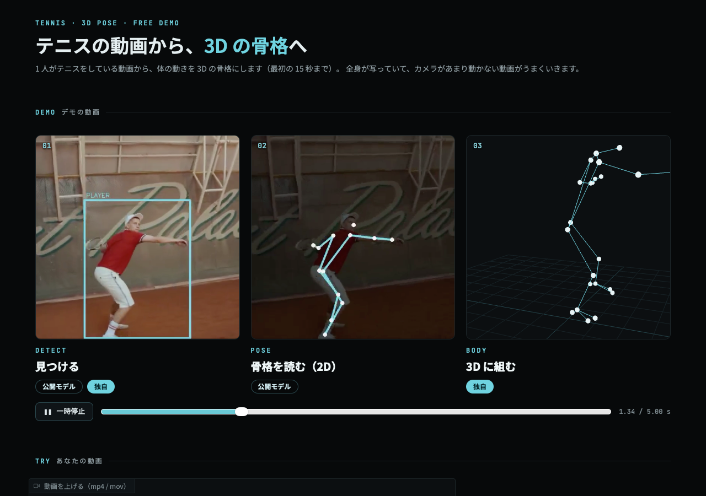
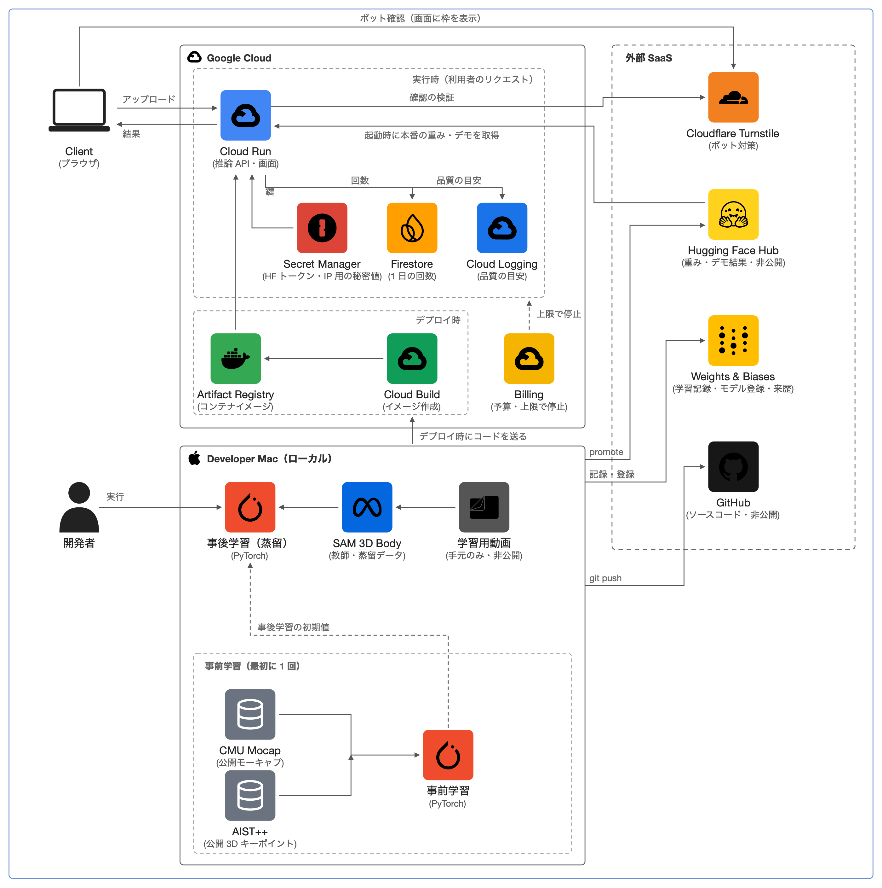

# tennis-3d-pose

テニスの動画 1 本（カメラ 1 台）から、選手の **3D 骨格（26 関節）** を推定する。
公開モデルで得た 2D 骨格を条件に、**拡散モデル** で 3D の動きを生成し、大規模モデル **SAM 3D Body を先生にした蒸留** でテニスの動きに合わせた。

**デモ**: https://tennis-3d-pose-308871972947.asia-northeast1.run.app （1 人 1 日 3 回まで。コードは非公開）



## 背景
テニスを始めて、プロ選手の体の細かい動きや、自分のフォームを 3D で見たいと思ったのがきっかけ。
スマホで撮った 1 本の動画から、ラケットを振る腕の向きや、体に隠れた側の脚まで含めて 3D で確かめられるようにしたい。

単眼の動画から 3D の姿勢を推定する大規模モデル（SAM 3D Body など）は高精度だが重く、1 コマ数秒かかる。
一方、テニスの 3D の正解データは公開されておらず、速い動きや体で隠れる関節が多い。
そこで、**軽い 2D → 3D の拡散モデルを、公開モーションで事前学習し、大規模モデルの出力で蒸留する** 方針を取った。

## 参考にした研究・使ったモデルとデータ
**手法**
- D3DP: W. Shan et al., *Diffusion-Based 3D Human Pose Estimation with Multi-Hypothesis Aggregation*, ICCV 2023. [arXiv:2303.11579](https://arxiv.org/abs/2303.11579) — 2D 条件の拡散モデル、x0 予測、複数候補の集約
- MixSTE: J. Zhang et al., *MixSTE: Seq2seq Mixed Spatio-Temporal Encoder for 3D Human Pose Estimation in Video*, CVPR 2022. [arXiv:2203.00859](https://arxiv.org/abs/2203.00859) — 空間・時間の注意を交互に掛けるネットワーク
- DDPM: J. Ho et al., *Denoising Diffusion Probabilistic Models*, NeurIPS 2020. [arXiv:2006.11239](https://arxiv.org/abs/2006.11239)
- DDIM: J. Song et al., *Denoising Diffusion Implicit Models*, ICLR 2021. [arXiv:2010.02502](https://arxiv.org/abs/2010.02502) — 少ないステップでの生成
- Improved DDPM: A. Nichol and P. Dhariwal, *Improved Denoising Diffusion Probabilistic Models*, ICML 2021. [arXiv:2102.09672](https://arxiv.org/abs/2102.09672) — cosine スケジュール
- 知識蒸留: G. Hinton et al., *Distilling the Knowledge in a Neural Network*, 2015. [arXiv:1503.02531](https://arxiv.org/abs/1503.02531)

**使った公開モデル**
- SAM 3D Body（Meta, 2025）— 蒸留の先生。[GitHub](https://github.com/facebookresearch/sam-3d-body) / [Hugging Face](https://huggingface.co/facebook/sam-3d-body-dinov3)
- ViTPose: Y. Xu et al., *ViTPose: Simple Vision Transformer Baselines for Human Pose Estimation*, NeurIPS 2022. [arXiv:2204.12484](https://arxiv.org/abs/2204.12484) — 2D 骨格（[usyd-community/vitpose-base-simple](https://huggingface.co/usyd-community/vitpose-base-simple)）
- RT-DETR: Y. Zhao et al., *DETRs Beat YOLOs on Real-time Object Detection*, CVPR 2024. [arXiv:2304.08069](https://arxiv.org/abs/2304.08069) — 人の検出（[PekingU/rtdetr_r18vd](https://huggingface.co/PekingU/rtdetr_r18vd)）

**データ**
- [CMU Graphics Lab Motion Capture Database](http://mocap.cs.cmu.edu/) — 事前学習（歩く・走る・スポーツなど幅広い動き）
- AIST++: R. Li et al., *AI Choreographer: Music Conditioned 3D Dance Generation with AIST++*, ICCV 2021. [arXiv:2101.08779](https://arxiv.org/abs/2101.08779) / [データ](https://google.github.io/aistplusplus_dataset/) — 事前学習（ダンス。3D キーポイントの注釈だけ使用、CC BY 4.0）
- [Wikimedia Commons のテニス教本動画](https://commons.wikimedia.org/wiki/Category:Videos_of_tennis)（CC BY-SA 3.0）— 蒸留
- [COCO Keypoints](https://cocodataset.org/#keypoints-2020) — 2D 骨格の 17 点の定義

## 手法
```
動画 ─> 人の検出・追跡（RT-DETR）─> 2D 骨格 17 点（ViTPose）─> 2D 条件の拡散モデル ─> 3D 骨格 26 点 ─> 骨の長さをそろえる
```
- **ネットワーク**: 関節ごとのトークンに、空間（関節間）と時間（コマ間）の注意を交互に掛ける MixSTE 型（4 層・64 次元・約 28 万パラメータ）。81 コマ（30 fps で約 2.7 秒）を 1 つの窓として扱う。
- **拡散**: ノイズを加えた 3D の列と 2D の列を入力に、元の 3D（x0）を予測する。cosine スケジュール 1000 段、生成は DDIM 10 ステップ × 候補 5 本の平均。
- **出力**: SAM 3D Body の骨格（MHR 70 点）から選んだ 26 関節。COCO の 17 点に、足先・かかと・親指の先・人差し指と小指の付け根などを足した。
- **見えない関節の扱い**: 2D が無い関節や、学習データに無い関節は「空」のトークン（学習する埋め込み）として入力し、損失に入れない。
  当初は親の関節の位置で埋めていたが、生成の途中で偽の位置が隣の関節を引っぱり、**足が崩れる**問題が出たため変更した。
- **後処理**: 骨の長さを区間の中でそろえる（拡散の出力は 1 コマごとに骨の長さが少し揺れるため）。

## 学習
1. **事前学習**（2 万ステップ・Mac で約 4 時間）: CMU と AIST++ の 3D の動きを、仮想カメラ（距離・高さ・向き・画角をばらつかせる）で 2D に写して入力にする。
   実際の 2D 骨格の誤りに強くするため、関節の欠け・区間の欠け・ずれ・外れ値・左右反転・速さの変化をわざと加える。
2. **蒸留**（2000 ステップ・約 20 分）: テニスの動画から選手を切り抜き、SAM 3D Body で 3D を推定して **正解と仮定**する。同じ映像の ViTPose の 2D から、それを再現するように学習する。
   SAM 3D Body と 2D 骨格の食い違いが大きいコマは除いた（Commons の動画では 10,057 コマ中 8,293 コマを使用）。
3. **見つけたバグ**: 切り抜いた映像を SAM 3D Body に渡す時、元の映像の画角をそのまま渡していた。切り抜きは元の映像の一部なので本当の画角はずっと狭く、体の奥行きが関節あたり約 5 cm ゆがんでいた。切り抜きの位置からコマごとに本当のカメラを作って直した。

## 結果
学習に使っていないプロ選手の 4 本で、SAM 3D Body の 3D と比べた体の関節の平均誤差（MPJPE）。PA は位置・向き・大きさをそろえた後の誤差。

| モデル | 学習データ | MPJPE | PA-MPJPE |
|---|---|---:|---:|
| 事前学習のみ | CMU ＋ AIST++ | 110 mm | 77 mm |
| **＋ 蒸留（Commons）= 公開中** | ＋ テニス教本動画 10 本（CC BY-SA） | 107 mm | 73 mm |
| ＋ 蒸留（研究用） | ＋ プロ選手 7 人の練習動画 | **84 mm** | **60 mm** |

- 公開データだけの蒸留（Commons）では改善は小さい（MPJPE -3%、PA -6%、ガタつき -12%）が、足先・かかとまで 26 関節すべてを出せるようになった。動画が少なく画質も低い（240〜360p、計 6 分）ことが効いている。
- プロ選手の動画で蒸留すると、誤差が約 24% 下がった。足（157 mm）と手（132 mm）は体の中心より大きく、今後の課題。
- 研究用の結果は YouTube の映像を使っているため公開サービスには使っていない。重みごとに学習データの出どころを記録し、商用で使えるデータだけの重みしか公開できない仕組みにしている。
- 公開データだけで精度を上げるには、自分で撮影したテニスの動画を増やすのが次の段階。

## 構成


- **学習は Mac（Apple シリコンの GPU）**。公開するのは推論だけで、Cloud Run（CPU）で動かし、使わない時は 0 台にする。
- **Weights & Biases** で学習の記録・モデルの登録・本番の印（production / candidate / previous）・データの来歴を管理（データ本体は上げない）。
- **Hugging Face Hub（非公開）** に重みとデモの結果を置き、Cloud Run は起動時に本番の版を読む。重みの更新はコンテナを作り直さずに済む。
- 公開の守り: 1 日の回数（全体 30・1 人 3、Firestore）、Cloudflare Turnstile、予算の上限。推論ごとに品質の目安（3D を 2D に写し戻した時のずれ、候補のばらつきなど）をログに出す。
